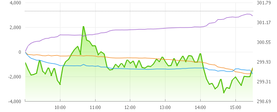

# 마크다운(Markdown)

> 일반 텍스트 형식 구문을 사용하는 마크업 언어의 일종으로 사용법이 쉽고 간결하여 빠르게 문서 정리를 할 수 있다. 단, 모든 HTML 마크업을 대체하지는 않는다.

## 1. 문법

### 1.1 Header

> 헤더는 제목을 표현할 때 사용한다. 단순히 글자의 크기를 표현하는 것이 아니라, 의미론적인 중요도를 나타낸다.

* `<h1>` 부터 `<h6>` 까지 표현할 수 있다.
* `#`의 개수로 표현하거나 <h1></h1>의 형태로 표현 가능하다.


# h1태그입니다.

## h2태그입니다.

### h3태그입니다.

#### h4태그입니다.

##### h5태그입니다.

###### h6태그입니다.


## 1.2 List

> 목록을 나열할 때 사용한다. 순서가 필요한 항목과 그렇지 않은 항목으로 구분할 수 있다. 순서가 있는 항목 아래에 순서가 없는 항목을 지정할 수 있으며, 그 반대로도 가능하다.

* 순서가 없는 목록
  * `*`혹은 `-`을 쓰고 스페이스 바를 누르면 생성할 수 있다.
  * tab 키를 눌러서 하위 항목을 생성할 수 있고, `shift + tab` 키를 눌러서 상위 항목으로 이동할 수도 있다.
* 순서가 있는 목록
  * `1.`을 누르고 스페이스바를 누르면 생성할 수 있다.
  * tab 키를 눌러서 하위 항목을 생성할 수 있고, `shift + tab` 키를 눌러서 상위 항목으로 이동할 수도 있다.


1. 순서가 있는 항목

2. 순서가 있는 항목

   1. 순서가 있는 하위 항목
   2. 순서가 있는 하위 항목

   * 순서가 없는 하위 항목

* 순서가 없는 항목
* 순서가 없는 항목
  * 순서가 없는 하위 항목
  * 순서가 없는 하위 항목


### 1.3 코드블럭

> 코드 블럭은 작성한 코드를 정리하거나 강조하고 싶은 부분을 나타낼 때 사용한다. 인라인과 블럭 단위로 사용할 수 있다.

* 인라인(inline)

  * 인라인으로 처리하고 싶은 부분을 `(백틱)으로 감싸준다.

* 블럭(block)

  * `(백틱)을 3번 입력하고 Enter을 눌러 생성한다.

  ex) 안녕하세요 인사를 변수에 담아서 세 번 출력하자.

  ```
  hello = '안녕하세요!'
  print(hello)
  
  ```

  

### 1.4 Image

> 로컬에 있는 이미지를 삽입하거나 이미지 링크를 활용하여 이미지를 나타낼 때 사용한다.

* ``를 작성하고, () 안에 이미지 주소를 입력한다. []안에는 이미지 파일 이름을 작성한다.
* 로컬에 이미지 파일을 저장한 경우, 절대 경로가 아닌 상대 경로를 사용해서 이미지를 저장한다.
* 


### 1.5 Link

> 특정 주소로 링크를 걸 때 사용한다.

* `[]()`을 작성하고, ()안에 링크 주소를 작성하고,  []안에 어떤 링크 주소인지 작성한다.
* [Python 자습서](https://docs.python.org/ko/3/tutorial/index.html)
* [파이썬 코딩도장](https://dojang.io/course/view.php?id=7)

### 1.6 Table

> 표를 작성하여 요소를 구분한다.

* |(파이프)사이에 컬럼을 작성하고 enter를 입력한다.
* 마지막 컬럼을 작성하고 뒤에 `|`를 붙여준다.


| 이름 | 나이 | 특기 |
| ---- | ---- | ---- |
|      |      |      |
|      |      |      |


### 1.7 기타

#### 인용문

* `>`를 입력하고 `enter` 키를 누른다.

* 인용문 안에 인용문을 작성하면 중첩해서 사용할 수 있다.

> $ pip install requests.
>
> >내게
> >
> >>빠져


#### 수평선

* `---`,`***`를 입력하여 작성한다.

저장

---

조건

---

반복

---


#### 강조

* 이탤릭체는 해당 부분을 `*`혹은 `_`(언더바)로 감싼다.
* 볼드체는 해당 부분을 `**`혹은 `__`(언더바 2개)로 감싼다.
* 취소선은 `~~`로 감싼다.


안녕하세요, *유도 메달리스트* 손초능입니다.

안녕하세요, __*주짓수 마스터*__ 제유빈입니다.